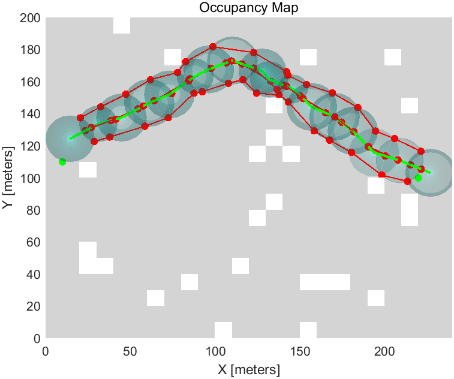

# Tube-RRT*
Tube-RRT*: Efficient Homotopic Path Planning for Swarm Robotics Passing-Through Large-Scale Obstacle Environments

**Tube-RRT*** is an efficient homotopic pah planning algorithm that builds upon and improves the Rapidly exploring Random Tree (RRT) algorithm. Tube-RRT* is specifically designed to generate homotopic paths for the trajectories in the virtual tube, strategically considering the opening volume and tube length to mitigate swarm congestion and ensure agile navigation.




**Video Links:** [YouTube](https://youtu.be/xDccyfEWrNc), [BiliBilli](https://www.bilibili.com/video/BV1uJ4m1n74m/?spm_id_from=333.1365.list.card_archive.click&vd_source=0759e6a3f1c9cb8bd9fc929716b8b946) for Mainland China.

## 1. Related Paper
Pengda Mao, Shuli Lv, and Quan Quan, "Tube-RRT*: Efficient Homotopic Path Planning for Swarm Robotics Passing-Through Large-Scale Obstacle Environments," IEEE Robotics and Automation Letters, Vol 10, No 3, 2025.
[DOI:10.1109/LRA.2025.3531151](https://ieeexplore.ieee.org/abstract/document/10844529).

## 2. Run in MATLAB
Run the TubeRRTStarDemo3.m in MATLAB.

## 2. Run in Ubuntu 18.04
```
cd cpp
catkin_make
roslaunch grid_path_searcher demo_successRate.launch
```
# Licence
The source code is released under [GPLv3](https://www.gnu.org/licenses/) license.

# Maintaince
For any technical issues, please contact Pengda Mao (maopengda@buaa.edu.cn) or Quan Quan (qq_buaa@buaa.edu.cn).
